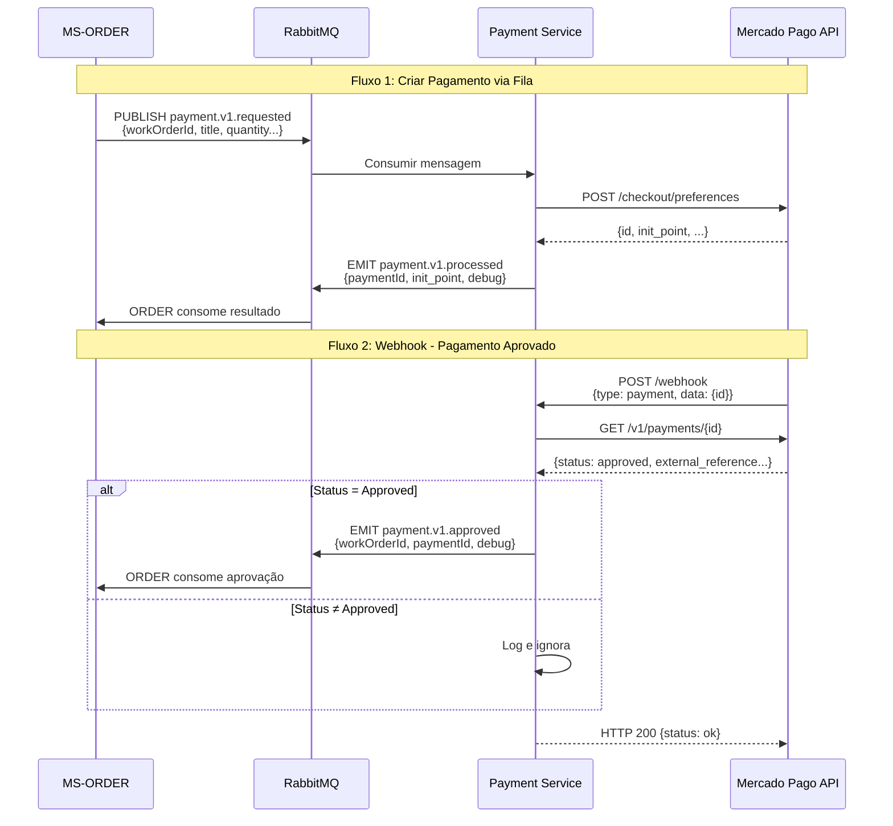
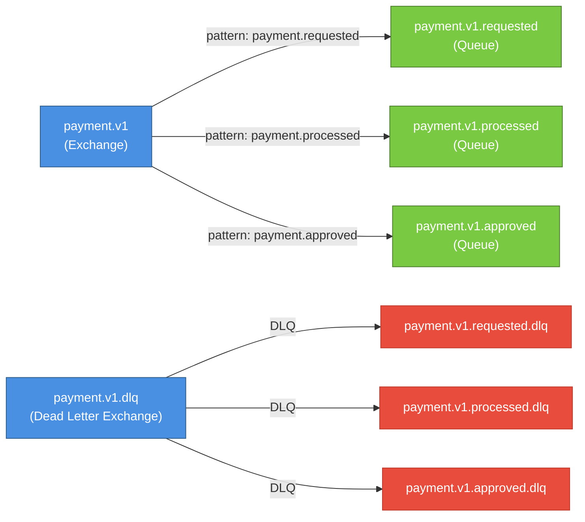
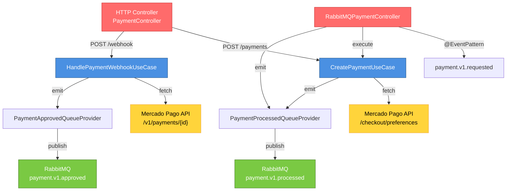
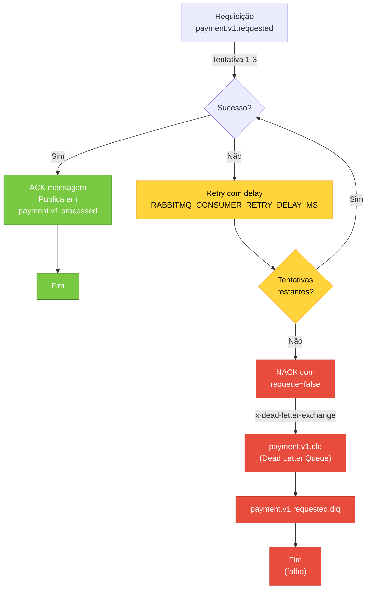

# Fluxo da Aplicação SOAT12-FSMT-MS-PAYMENT

## Diagrama de Sequência do Processamento de Pagamentos



## Estrutura das Filas RabbitMQ



## Payload das Filas

### payment.v1.requested (Entrada - consumida de ORDER)
```json
{
  "workOrderId": 12345,
  "title": "Troca de filtro de ar",
  "quantity": 2,
  "unitPrice": 149.9,
  "currencyId": "BRL",
  "payerEmail": "cliente@exemplo.com"
}
```

### payment.v1.processed (Saída - enviada após criar preferência)
```json
{
  "workOrderId": 12345,
  "paymentId": "203445-21c9c2ab-5209-425b-8787-8259ac4cbe6e",
  "status": "created",
  "init_point": "https://www.mercadopago.com.br/checkout/v1/redirect?pref_id=...",
  "debug": {
    "id": "203445-21c9c2ab-5209-425b-8787-8259ac4cbe6e",
    "items": [...],
    "external_reference": "12345",
    "payer": {...},
    ...
  }
}
```

### payment.v1.approved (Saída - enviada após webhook de pagamento aprovado)
```json
{
  "workOrderId": 12345,
  "paymentId": "987654321",
  "status": "approved",
  "fullPayload": {
    "webhook": { "type": "payment", "data": { "id": "987654321" } },
    "payment": { "id": 987654321, "status": "approved", "external_reference": "12345", ... }
  },
  "debug": {
    "webhook": { "type": "payment", "data": { "id": "987654321" } },
    "payment": { "id": 987654321, "status": "approved", ... }
  }
}
```

## Componentes Principais



## Fluxo de Retry e DLQ



## Configurações Importantes

| Variável | Valor Padrão | Descrição |
|----------|-------------|-----------|
| `RABBITMQ_URL` | - | URL de conexão ao RabbitMQ |
| `RABBITMQ_CONSUMER_MAX_RETRIES` | 3 | Máximo de tentativas ao processar mensagem |
| `RABBITMQ_CONSUMER_RETRY_DELAY_MS` | 1000 | Delay entre tentativas (ms) |
| `MERCADOPAGO_ACCESS_TOKEN` | - | Token de autenticação Mercado Pago |
| `DLQ_REPUBLISH_TO_MAIN` | false | Republicar mensagens de DLQ para fila principal |
